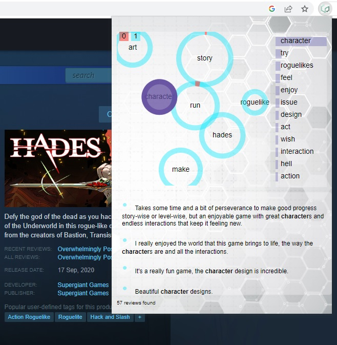

# Game Review Topic Explorer

This Chrome extension provides an interactive visualization of the topic model analysis for game reviews. 
  
## How to Install the PopupExtension Chrome Extension

### Manual Installation

Chrome extensions that are not hosted on the Chrome Web Store require manual installation. Here are the steps to follow:

1. **Download the Extension Files**

    Click the following link to download the Chrome Extension:

    [Download PopupExtension](https://github.com/jimmyziqw/topic-visualizer-chrome-extension/blob/main/popupExtension.zip)

    This will download a zipped file named `popupExtension.zip`.

2. **Unzip the Extension Files**

    Use your preferred method to unzip the file.

    - On Windows, you can right-click the file and choose `Extract All...`
    - On MacOS, you can double-click the file to unzip it.

3. **Open Google Chrome Extensions Page**

    In your Chrome browser, navigate to the Extensions page.

    You can do this by typing `chrome://extensions/` in the address bar and pressing `Enter`.

4. **Enable Developer Mode**

    At the top-right of the Extensions page, there is a switch labeled `Developer mode`. Toggle this switch on.

5. **Load Unpacked Extension**

    Click the `Load unpacked` button on the top-left side of the Extensions page. This will open a file-selection dialog.

6. **Select the Extension Folder**

    Navigate to the location where you unzipped the `popupExtension.zip` file, select the `popupExtension` folder, then click the `Select` or `OK` button on the dialog.

The PopupExtension should now be installed in your Chrome browser. You should see the extension's icon in the toolbar. If you do not see the icon, it might be hidden inside the Extensions menu (a puzzle piece icon).
